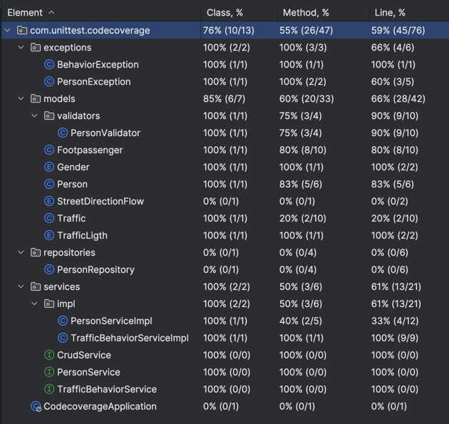
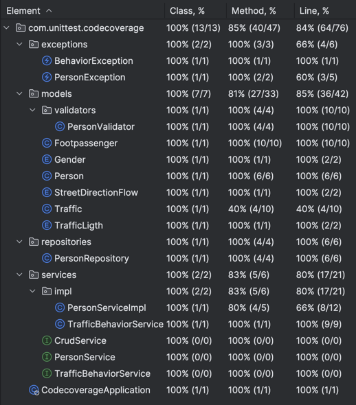

# Coverage
با اجرای تست‌ها در مرحله اول و قبل از اضافه کردن تست جدید، وضعیت coverage بصورت زیر است:

با تعریف تست برای آپدیت کردن در سرویس Person، کاورج آن افزایش می‌یابد و کاورج کلاس Person نیز کامل می‌شود. همچنین با تعریف تست برای get کردن در این کلاس، کاورج کلاس PersonException و PersonValidator نیز افزایش می‌یابد. 

در ادامه PersonRepositoryTest را برای تست کردن کلاس PersonRepository اضافه می‌کنیم.

برای افزایش کاورج در مدل‌ها، یک تست جدید به TrafficBehaviorServiceTest اضافه می‌کنیم که کاورج همه‌ی مدل‌ها را افزایش می‌دهد.

در انتها CodecoverageApplicationTests را کامل می‌کنیم تا کلاس اصلی برنامه نیز تست داشته باشد.

در نتیجه این تغییرات، وضعیت تست‌ها به صورت زیر شد:

البته تعدادی مشکل در کد وجود داشت که باعث فیل شدن تست و یا تاثیر نداشتن آن در coverage می‌شد که این خطاها نیز رفع شدند.
